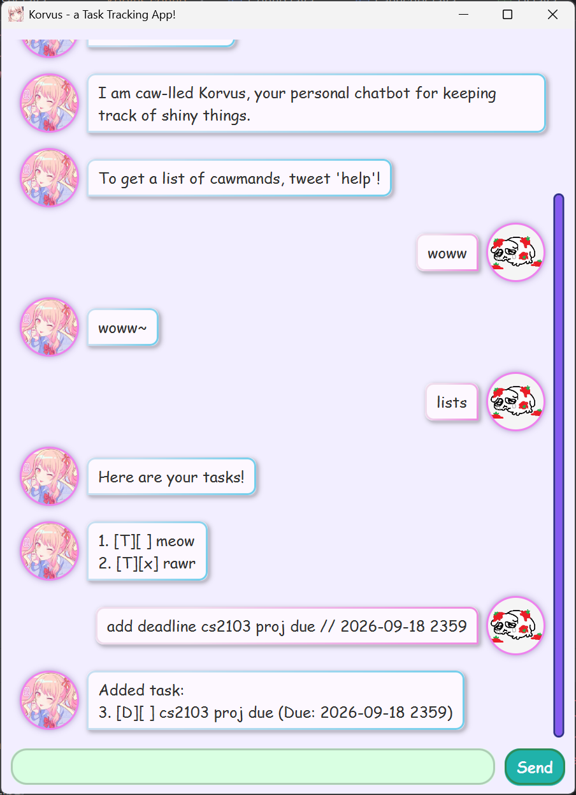

# Korvus User Guide
Welcome to **Korvus**, a chatbot application to track your tasks for you!<br>
This is the **User Guide** for using _Korvus_, containing useful information needed to use _Korvus_ effectively.

To download the application, you go [here](https://github.com/MeowyMacMeowza/ip/releases) to download the jar file.<br>
_Note that you may need **Java 25** to run the korvus.jar file._ 

## Product Screenshot


# What Is Korvus?
> A fully customised GUI-application equipped with tools for tracking various types of tasks, this application is for command line enthusiasts!

With its intuitive and robust commands, this app can help track your most essential tasks so that you can sit back, relax, and never forget another task again!<br>
_**Note: effects may vary between individuals_

# Key Features

This section will outline the key features of the Korvus!

As a general note for Korvus:
- The bot is command-driven, so most of its functionality is through the chatbot's features
- All user inputs will be trimmed of whitespace.
  - Example: `"  lists "` will be pruned to `"lists"`
- Commands (and its parameters) are **case-sensitive**.
- There may be shorthands for some of the commands! But not all!

Happy Typing!

## Help - to see a list of commands
> This command will display a list of commands that the bot support, along with some details and command format.

Command Format(s)
1. `help`
   - Displays a helpful list of commands that Korvus uses.

_Example Output_
```
Here are a list of cawmands!
For any invalid cawmands, I will simply parrot them back~
--------------------------------------------------------------------
list[s], task[s] - View your tasks.
--------------------------------------------------------------------
add task <task> - Adds a task with name <task>.
Use the flags -t for a ToDo, -d for a Deadline and -e for an Event.
 -t <task> : Adds a ToDo Task.
...
```

## Adding tasks (General)
> This command will add a new task based on the parameters provided.<br>
> If there are any huge errata, this command may fail instead.

Command Formats
1. `add task <task_name>`
   - Adds a todo with name <task_name>. <task_name> cannot start with "-".
2. `add task -t <task_name>` 
   - Adds a todo with name <task_name>. <task_name> cannot start with "-".
3. `add task -d <task_name> // <deadline>` 
   - Adds a deadline with name <task_name> and deadline <deadline>. <task_name> cannot start with "-".
   - If <deadline> is invalid, `unknown` is shown instead.
4. `add task -e <task_name> // <start_datetime> // <end_datetime>`
   - Adds an event with name <task_name>. <task_name> cannot start with "-".
   - If <start_datetime> is invalid, `unknown` is shown instead.
   - If <end_datetime> is invalid, `unknown` is shown instead.

_Example Output_
```
Added task:
3. [D][ ] cs2103 ip (Due: 2026-09-18 2359)
```

## Adding todos
> This command will add a todo task based on the parameters provided.<br>
> If there are any huge errata, this command may fail instead.

Command Formats
1. `[add ]todo <task_name>`
    - Adds a todo with name <task_name>. <task_name> cannot start with "-".

_Example Output_
```
Added task:
1. [T][ ] pre-read week 7 notes
```

## Adding deadlines
> This command will add a deadline task based on the parameters provided.<br>
> If there are any huge errata, this command may fail instead.

Command Formats
1. `[add ]deadline <task_name> // <deadline>`
    - Adds a deadline with name <task_name> and deadline <deadline>. <task_name> cannot start with "-".
    - If <deadline> is invalid, `unknown` is shown instead.

_Example Output_
```
Added task:
2. [D][ ] tp feature specification (Due: 2026-09-20 2359)
```

## Adding events
> This command will add an event task based on the parameters provided.<br>
> If there are any huge errata, this command may fail instead.

Command Formats
1. `[add ]event <task_name> // <start_datetime> // <end_datetime>`
    - Adds an event with name <task_name>. <task_name> cannot start with "-".
    - If <start_datetime> is invalid, `unknown` is shown instead.
    - If <end_datetime> is invalid, `unknown` is shown instead.

_Example Output_
```
Added task:
4. [E][ ] reading week (Duration: 2026-09-21 0000 - 2026-09-27 2359)
```

## List tasks
> This command will show the list of tasks currently stored in Korvus.

Command Formats
1. `list[s]`, `task[s]`
    - Displays the list of tasks that the user currently has.
    - Includes the **both** finished and unfinished tasks.
    - Ordered by add order, older tasks have lower index.

_Example Output_
```
Here are your tasks!
--------------------------------------------------------------------
1. [T][ ] pre-read week 7 notes
2. [D][ ] tp feature specification (Due: 2026-09-20 2359)
3. [D][ ] cs2103 ip (Due: 2026-09-18 2359)
4. [E][x] reading week (Duration: 2026-09-21 0000 - 2026-09-27 2359)
...
```

## Do task (Mark as done)
> This command will attempt to mark a task as done.

Command Formats
1. `do[ne] task <task_name>`
   - Tries to mark the task with name <task_name> as done.
   - Searches through the task lists to find an **exact match** of the task name
   - If the task is already done, an error message will show instead.
2. `do[ne] task <task_id>`
   - Tries to mark the task with index <task_index> as done.
   - If the task is already done, an error message will show instead.

**Korvus will first assume that the command parameter is <task_id> first.**<br>
If the parameter is an invalid index, then it will be taken as <task_name>.<br>
An error message will show up if there are no matches in both cases.

_Example Output_
```
Success! Task has been marked done!
4. [E][x] reading week (Duration: 2026-09-21 0000 - 2026-09-27 2359)
```

## Undo task (Mark as undone)
> This command will attempt to mark a task as not done.

Command Formats
1. `undo[ne] task <task_name>`
    - Tries to mark the task with name <task_name> as not done.
    - Searches through the task lists to find an **exact match** of the task name
    - If the task is not done, an error message will show instead.
2. `undo[ne] task <task_id>`
    - Tries to mark the task with index <task_index> as not done.
    - If the task is not done, an error message will show instead.

**Korvus will first assume that the command parameter is <task_id> first.**<br>
If the parameter is an invalid index, then it will be taken as <task_name>.<br>
An error message will show up if there are no matches in both cases.

_Example Output_
```
Success! Task has been unmarked!
4. [E][ ] reading week (Duration: 2026-09-21 0000 - 2026-09-27 2359)
```

## Delete task
> This command will attempt to delete a task from the task list.

Command Formats
1. `del[ete] task <task_name>`
    - Tries to delete the task with name <task_name>.
    - Searches through the task lists to find an **exact match** of the task name.
2. `del[ete] task <task_id>`
    - Tries to delete the task with index <task_index>.

**Korvus will first assume that the command parameter is <task_id> first.**<br>
If the parameter is an invalid index, then it will be taken as <task_name>.<br>
An error message will show up if there are no matches in both cases.

_Example Output_
```
Success! Task ([T][x] week 5 quiz) has been deleted!
Take note that the other tasks may have new indexes now.
Do tweet "list" or "task" to view your updated tasklist.
```

## Find tasks with keywords
> This command will find all tasks with the corresponding keywords.

Command Formats
1. `find task <keyword>`
    - Finds all tasks where <keyword> **is a part of** its name. (Not an exact match!)
    - Index of task is **preserved** in the output.
    - An error message will show up if there are no such tasks.

_Example Output_
```
No task matches your query: assignments
--------------------------------------------------------------------
...
--------------------------------------------------------------------
There are task(s) matching your query!
--------------------------------------------------------------------
1. [T][ ] pre-read week 7 notes
4. [E][x] reading week (Duration: 2026-09-21 0000 - 2026-09-27 2359)
```

## Echo~
> This command will echo the user's messages~<br>
> Not a callable command, but will be called if there is any invalid commands~

Command Formats
1. _Any invalid commands_
    - Echoes the message back~
    - If the input is empty, just prints "Caw~"

_Example Output_
```
Caw~
```

## Undo previous (task) command
> This command will attempt to undo the previous task command.
> This applies to **only** add, delete, do and undo commands.

Command Formats
1. `undo last`, `cancel last`
    - Undoes the last task command executed
      - This applies to _add, delete, do, undo_
    - Has a depth of last 10 actions
    - Cannot undo an undo action

_Example Output_
```
Sucessfully undid action for:
4. [E][x] reading week (Duration: 2026-09-21 0000 - 2026-09-27 2359)
```

## Bye~~
> This command will exit the program
> Do you wanna leave me :(

Command Formats
1. `bye`, `goodbye`
   - Exits the program
   - Saves tasks and config in this step, **do not exit the program in this state**.
     - If there are any errors, will abort the process
     - Use the flag `-f` to force an exit (regardless whether it saves)

_Example Output_
```
Saving session information to disk...
--------------------------------------------------------------------
Goodbye! Eagle to see you again!
```